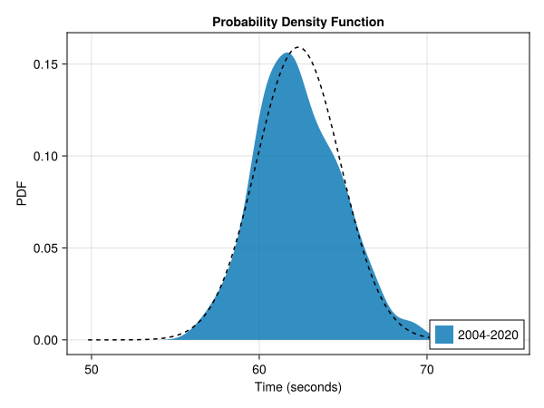
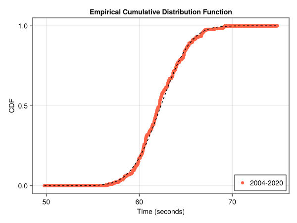
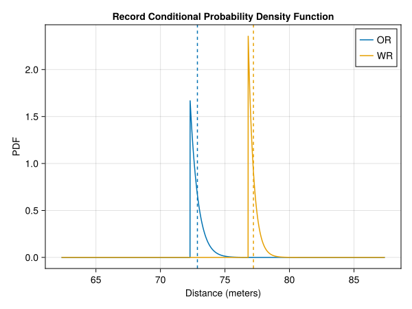

# Discus Throw Women

In this article we will analyse the women's discus throw event at the olympics. For this we will use the data from the finals of all previous summer olympics from Athens 2004 up to Tokio 2020. 

## The distribution

The distribution of the data looks like a normal distributions. We will assume that the data is normal distributed with the sample mean and sample standard deviation. There are 96 fouls registered of the total of 281 throws. This results in a $$ 34.16\% \pm 6.83\% $$ probability of a foul.

We can also look at the cumulative distribution function of the data.

This plot also shows a good agreement with a normal distribution. We can perform the Anderson-Darling test to check if the data is explained by the fitted distribution. The p-value of an one-sample Anderson-Darlign test is given by 0.70. We must retain the null-hypothesis that the throwing distances are normal distributed with mean $$ 62.33 m \pm 0.37 m $$ and standard deviation 2.51m.

## Medals
Given the distribution of the throwing distances of the athletes we can determine the distribution of the first, second and third distance of a sample. The final consists of 12 athletes each with 3 throws and 8 of them may throw another 3 times. This gives us a sample size of 60 throws. The expected number of fouls is 21 and the expected value of the medal distances with 39 throws are

| Place | Expected Distance (m) | 95% Confidence Interval (m) |
| ----- | ------------- | --------- |
| 1st | 67.72 | [65.68, 70.40] |
| 2nd | 66.70 | [65.09, 68.60] |
| 3nd | 66.10 | [64.69, 67.70] |

The probability that a given distance wins at least a gold, silver or bronze medal can also be calculated.

## Records
The current records are

| Record | Distance (m) |
|----|-------|
| OR | 72.3|
| WR | 76.8|

We can also look at the probability distributions of the time of the new record. This also allows for the calculation of the expected value of the new records and the probability that we'll see a new record.

| Record | Probability | Expected Value (m)|  95% Confidence Interval (m) |
| -- | ------ | --- | ---- |
| OR | 0.65% | 72.86 | [72.31, 74.32] |
| WR | 7.28e-5% | 77.21 | [76.81, 78.29] |

## Paris 2024
During the final at the Paris 2024 olympics there were 60 jumps registered. Of these jumps 25 of them were a foul or $$ 41.67\% \pm 12.48\% $$. This overlaps with the confidence interval of the predicted expected value based on previous olympics, but it is just outside the confidence interval.

Representing the United States, Valarie Allman won the gold medal with a distance of 69.50m. This falls well within the 95% confidence interval and deviates only 1.78m of the predicted expected value.

Feng Bin managed to get Silver for China with a distance of 67.51m. This distance is 81cm removed from the expected value and falls again well within the confidence interval.

The Croatia won the bronze medal with Sandra Elkasević, who also threw the discus 67.51m. Again this falls within the confidence interval and differs by 1.41m from the predicted expected value.

At the Paris 2024 olympics no records were broken in the women's discus throw. This was to be expected if one looks at the very small probabilities to break this records.
