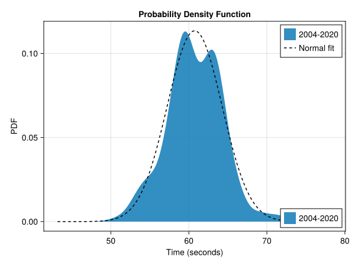
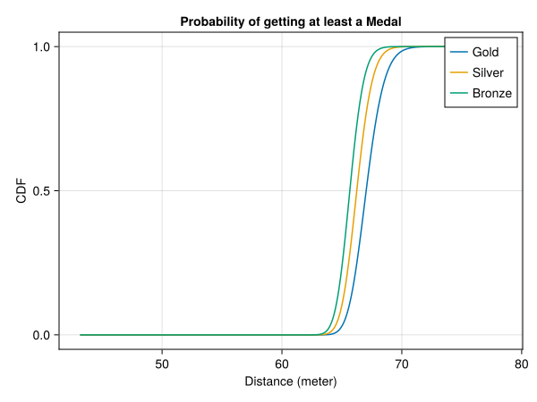
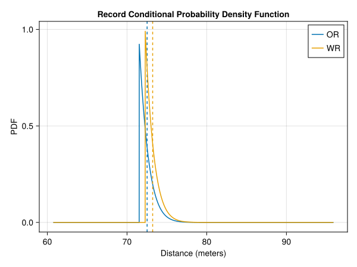

# Javelin Throw Women

In this article we will analyse the women's javelin throw event at the olympics. For this we will use the data from the finals of all previous summer olympics from Athens 2004 up to Tokio 2020. 

## The distribution

The distribution of the data looks like a normal distributions. We will assume that the data is normal distributed with the sample mean and sample standard deviation. There are 69 fouls registered of the total of 219 throws. This results in a $$ 23.96\% \pm 5.66\% $$ probability of a foul.

We can also look at the cumulative distribution function of the data.

This plot also shows a good agreement with a normal distribution. We can perform the Anderson-Darling test to check if the data is explained by the fitted distribution. The p-value of an one-sample Anderson-Darlign test is given by 0.63. We must retain the null-hypothesis that the throwing distances are normal distributed with mean $$ 60.75 m \pm 0.47 m $$ and standard deviation 3.52m.

## Medals
Given the distribution of the throwing distances of the athletes we can determine the distribution of the first, second and third distance of a sample. The final consists of 12 athletes each with 3 throws and 8 of them may throw another 3 times. This gives us a sample size of 60 throws. The expected number of fouls is 15 and the expected value of the medal distances with 45 throws are

| Place | Expected Distance (m) | 95% Confidence Interval (m) |
| ----- | ------------- | --------- |
| 1st | 68.51 | [65.71, 72.20] |
| 2nd | 67.10 | [64.91, 69.71] |
| 3nd | 66.29 | [64.36, 68.48] |

The probability that a given distance wins at least a gold, silver or bronze medal can also be calculated.

## Records
The current records are

| Record | Distance (m) |
|----|-------|
| OR | 71.53|
| WR | 72.28|

We can also look at the probability distributions of the distance of the new record. This also allows for the calculation of the expected value of the new records and the probability that we'll see a new record.

| Record | Probability | Expected Value (m)|  95% Confidence Interval (m) |
| -- | ------ | --- | ---- |
| OR | 21.08% | 72.52 | [71.55, 74.97] |
| WR | 10.73% | 73.22 | [72.30, 75.55] |

## Paris 2024
During the final at the Paris 2024 olympics there were 59 throws registered. Of these throws 12 of them were a foul or $$ 20.34\% \pm 10.28\% $$. This agrees well with the predicted expected value based on previous olympics.

Representing Japan, Haruka Kitaguchi won the gold medal with a distance of 65.80m. This falls just within the 95% confidence interval and deviates 2.71m of the predicted expected value.

Jo-Ane van Dyk managed to get Silver for South Africa with a distance of 63.93m. This distance is 3.17m removed from the expected value and falls slightly out of the confidence interval.

Czech Republic won the bronze medal with Nikola Ogrodníková, who threw the javelin 63.68m. Again this falls slightly out of the confidence interval and differs by 2.61m from the predicted expected value.