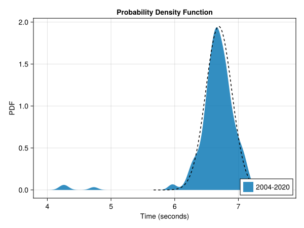
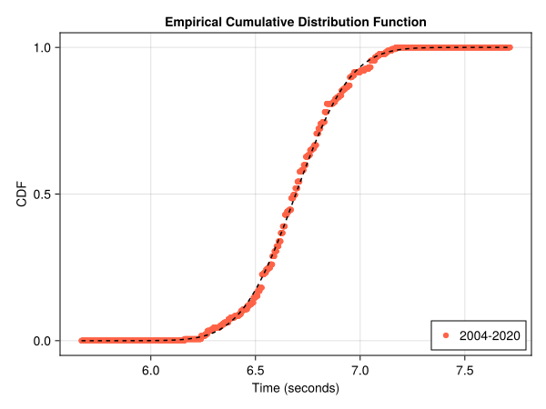
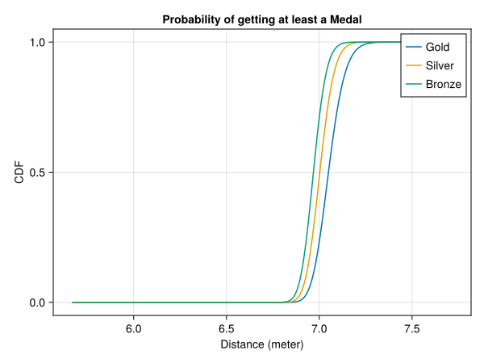
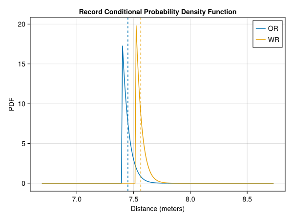

# Long Jump Women

In this article we will analyse the women's long jump event at the olympics. For this we will use the data from the finals of all previous summer olympics from Athens 2004 up to Tokio 2020. 

## The distribution

The distribution of the data looks like a normal distributions, when we only look at the jumps beyond 6m. We will assume that the data is normal distributed with the sample mean and sample standard deviation. There are 83 fouls registered of the total of 182 jumps. This results in a $$ 31.32\% \pm 6.74\% $$ probability of a foul.

We can also look at the cumulative distribution function of the data, only considering jumps beyond 6m.

This plot also shows some deviations from the fitted distribution but it doesn't look that bad especially for the higher distances. We can perform the Anderson-Darling test to check if the data is explained by the fitted distribution. The p-value of an one-sample Anderson-Darlign test is given by 0.91. We must retain the null-hypothesis that the jumping distances are normal distributed with mean $$ 6.69 m \pm 0.04 m $$ and standard deviation 0.20m.

## Medals
Given the distribution of the jumping distances of the athletes we can determine the distribution of the first, second and third distance of a sample. The final consists of 12 athletes each with 3 jumps and 8 of them may jump another 3 times. This gives us a sample size of 60 jumps. The expected number of fouls is 19 and the expected value of the medal distances with 41 jumps are

| Place | Expected Distance (m) | 95% Confidence Interval (m) |
| ----- | ------------- | --------- |
| 1st | 7.14 | [6.97, 7.36] |
| 2nd | 7.05 | [6.92, 7.21] |
| 3nd | 7.01 | [6.89, 7.14] |

The probability that a given distance wins at least a gold, silver or bronze medal can also be calculated.

## Records
The current records are

| Record | Distance (m) |
|----|------- |
| OR | 7.40 |
| WR | 7.52 |

We can also look at the probability distributions of the distance of the new record. This also allows for the calculation of the expected value of the new records and the probability that we'll see a new record.

| Record | Probability | Expected Value (m)|  95% Confidence Interval (m) |
| -- | ------ | --- | ---- |
| OR | 4.74% | 7.45 | [7.40, 7.59] |
| WR | 0.47% | 7.56 | [7.52, 7.69] |

## Paris 2024
During the final at the Paris 2024 olympics there were 60 jumps registered. Of these jumps 7 of them were a foul or $$ 11.67\% \pm 8.13\% $$. This overlaps with the confidence interval of the predicted expected value based on previous olympics, but it does not fall within the confidence interval.

Representing the United States, Tara Davis-Woodhall won the gold medal with a distance of 7.10m. This falls well within the 95% confidence interval and deviates only 4cm of the predicted expected value.

Malaika Mihambo managed to get Silver for Germany with a distance of 6.98m. This distance is 6cm removed from the expected value and falls again well within the confidence interval.

The United States also won the bronze medal with Jasmine Moore, who jumped 6.96m. Again this falls well within the confidence interval and only differs by 5cm from the predicted expected value.

At the Paris 2024 olympics no records were broken in the women's long jump discipline. This was to be expected if one looks at the small probabilities to break this records.
