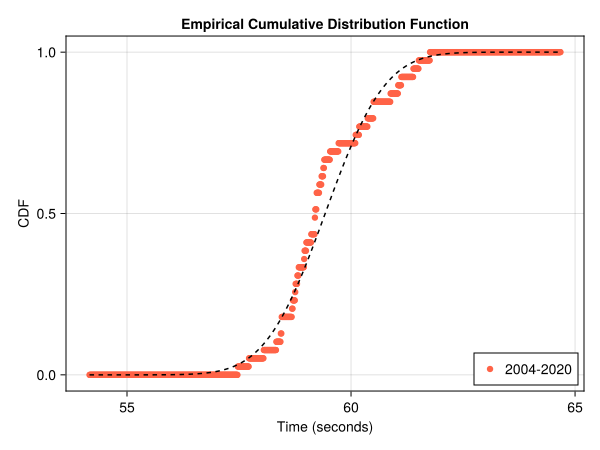
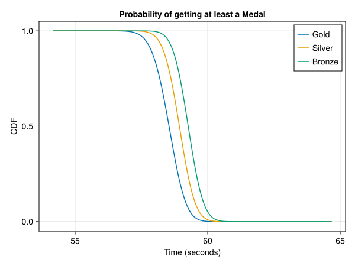
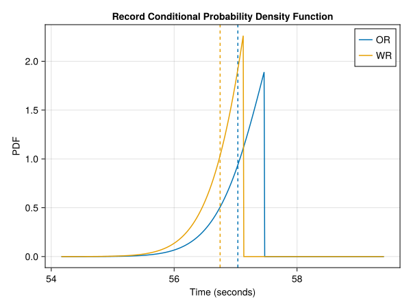

# 100m Backstroke Women

In this article we will analyse the women's 100m backstroke event at the olympics. For this we will use the data from the finals of all previous summer olympics from Athens 2004 up to Tokio 2020. 

## The distribution

The distribution of the data looks like a normal distribution, but it also has more structure. There is a second bump in the tail, prossibly representing the non-medal candidates. Keep in mind that the data only comprises 40 entries. We will assume that the data is normal distributed with the sample mean and sample standard deviation.

We can also look at the cumulative distribution function of the data.

This plot also shows some deviations from the fitted distribution but it doesn't look that bad especially for the fast times. We can perform the Anderson-Darling test to check if the data is explained by the fitted distribution. The p-value of an one-sample Anderson-Darlign test is given by 0.39. We must retain the null-hypothesis that the finishing times are normal distributed with mean 59.42s and standard deviation 1.05s.

## Medals
Given the distribution of the times of the athletes we can determine the distribution of the first, second and third time of a sample. The final consists of 8 athletes as such we need to consider a samplesize of 8. The expected value of the medal times are

| Place | Expected Time (s) |
| ----- | ------------- |
| 1st | 57.93 |
| 2nd | 58.53 |
| 3nd | 58.93 |

The probability that a given time wins at least a gold, silver or bronze medal can also be calculated.

## Records
The current records are

| Record | Time (s) |
|----|-------|
| OR | 124.1|
| WR | 123.1|

We can also look at the probability distributions of the time of the new record. This also allows for the calculation of the expected value of the new records and the probability that we'll see a new record.

| Record | Probability | Expected Value (s)|
| -- | ------ | --- |
| OR | 22.70% | 57.04 |
| WR | 11.12% | 56.75 |

## Paris 2024
