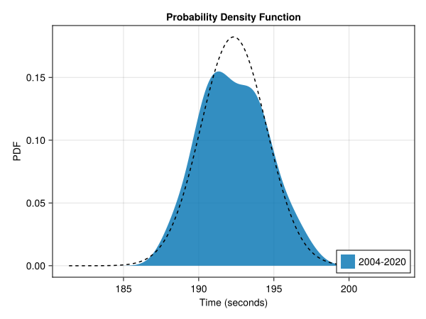
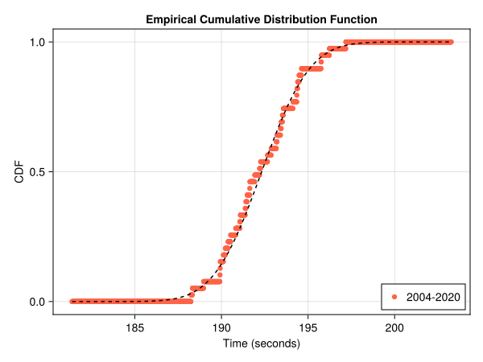
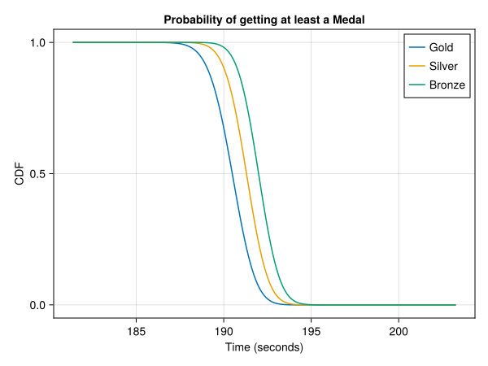
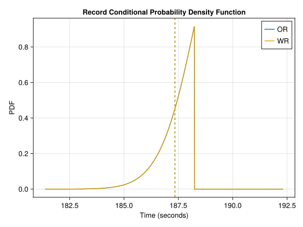

# 4x100m Freestyle Men

In this article we will analyse the men's 4x100m freestyle event at the olympics. For this we will use the data from the finals of all previous summer olympics from Athens 2004 up to Tokio 2020. 

## The distribution

The distribution of the data has some structure. It is bimodal and looks like the combination of two normal distributions. This structure might represent the two different types of athletes in the final. On one hand we have the athlete that are medal contenders and on the other hand we have the athletes that made it to the final but are not as fast as the medal contenders. Keep in mind that the data only comprises 40 entries. We will ignore this structure for now and assume that the data is normal distributed with the sample mean and sample standard deviation.

We can also look at the cumulative distribution function of the data.

This plot also shows some deviations from the fitted distribution but it doesn't look that bad especially for the fast times. We can perform the Anderson-Darling test to check if the data is explained by the fitted distribution. The p-value of an one-sample Anderson-Darlign test is given by 0.98. We must retain the null-hypothesis that the finishing times are normal distributed with mean 192.32s and standard deviation 2.19s.

## Medals
Given the distribution of the times of the athletes we can determine the distribution of the first, second and third time of a sample. The final consists of 8 athletes as such we need to consider a samplesize of 8. The expected value of the medal times are

| Place | Expected Time (s) |
| ----- | ------------- |
| 1st | 189.20 |
| 2nd | 190.46 |
| 3nd | 191.29 |

The probability that a given time wins at least a gold, silver or bronze medal can also be calculated.

## Records
The current records are

| Record | Time (s) |
|----|-------|
| OR | 188.24|
| WR | 188.24|

We can also look at the probability distributions of the time of the new record. This also allows for the calculation of the expected value of the new records and the probability that we'll see a new record.

| Record | Probability | Expected Value (s)|
| -- | ------ | --- |
| OR | 22.36% | 187.34 |
| WR | 22.36% | 187.34 |

## Paris 2024
